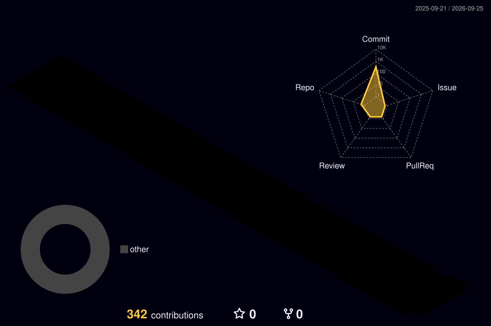
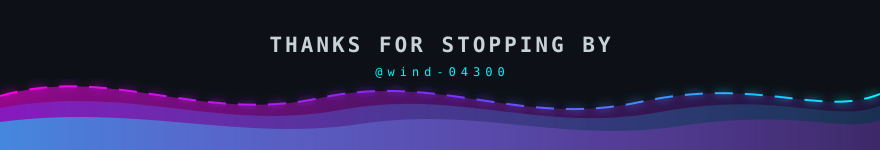

<!-- ══════════════════════════════════════════════════════════════════════════
     ✦  郑明娟 (wind-04300) · GitHub Profile  ✦
     Theme : Neon Cyberpunk
     ══════════════════════════════════════════════════════════════════════════

     ⚠️  IMPORTANT — 为什么所有图片都是 ./ 相对路径？

     github-readme-stats / github-profile-trophy / github-readme-activity-graph /
     capsule-render 全部托管在 *.vercel.app 上，这些域名在国内被 DNS 污染
     （会解析到 69.63.176.143、108.160.170.52 之类的假 IP），图片必然加载失败。

     所以本页所有图片都改为「自托管」：由 GitHub Actions 生成后提交进本仓库，
     再用相对路径引用。相对路径由 GitHub 自己伺服，不经过任何第三方域名，
     在任何网络环境下都能正常显示。

     卡片生成脚本 : .github/scripts/gen_cards.py
     自动刷新     : .github/workflows/cards.yml  (每天 11:00 北京时间)
     ══════════════════════════════════════════════════════════════════════════ -->

<!-- ╔══════════════════════ ① HERO BANNER ══════════════════════╗ -->
<div align="center">
  
</div>

<!-- ╔══════════════════════ ② ANIMATED TITLE ══════════════════════╗ -->
<div align="center">

  

  <br/>

  

</div>

<!-- ╔══════════════════════ ③ LIVE BADGES ══════════════════════╗ -->
<div align="center">
  <br/>
  <a href="https://github.com/wind-04300">
    
  </a>
  <a href="https://github.com/wind-04300?tab=followers">
    
  </a>
  <a href="https://github.com/wind-04300?tab=repositories">
    
  </a>
  <a href="https://github.com/wind-04300?tab=repositories">
    
  </a>
</div>

<br/>

---

<!-- ╔══════════════════════ ④ ABOUT ME ══════════════════════╗ -->
<h2 align="center">🧑‍💻 <code>whoami</code></h2>

```yaml
┌──(郑明娟㉿github)-[~]
└─$ cat profile.yml

name       : 郑明娟 · Mingjuan Zheng
role       : 大二学生 / Sophomore
location   : 深圳 · 龙岗 / Shenzhen, China
focus      : 智能体 (AI Agent) 开发
learning   : 大模型应用 · Prompt 工程 · Python
hobbies    : 探索新工具 · 折腾 AI · 记录生活
motto      : "Talk is cheap. Show me the code. — Linus Torvalds"

status     : 🟢 Online & Building
coffee     : ████████████████████ 100%  ☕
```

<!-- ╔══════════════════════ ⑤ TECH ARSENAL ══════════════════════╗ -->
<h2 align="center">⚔️ Tech Arsenal</h2>

<div align="center">

<p><b>Languages &amp; Frameworks</b></p>


<p><b>Tools &amp; Platforms</b></p>


<br/><br/>


</div>

<br/>

---

<!-- ╔══════════════════════ ⑥ GITHUB STATS ══════════════════════╗ -->
<h2 align="center">📊 GitHub Analytics</h2>

<div align="center">

  

  <br/><br/>

  

  <br/><br/>

  

</div>

<!-- ╔══════════════════════ ⑦ ACHIEVEMENTS ══════════════════════╗ -->
<h2 align="center">🏆 Trophy Cabinet</h2>

<div align="center">
  
</div>

<!-- ╔══════════════════════ ⑧ ACTIVITY GRAPH ══════════════════════╗ -->
<h2 align="center">📈 Contribution Timeline</h2>

<div align="center">
  
</div>

<!-- ╔══════════════════════ ⑨ 3D CONTRIBUTION ══════════════════════╗ -->
<h2 align="center">🧊 3D Contribution Skyline</h2>

<div align="center">
  
</div>

<!-- ╔══════════════════════ ⑩ SNAKE ══════════════════════╗ -->
<h2 align="center">🐍 Watch My Contributions Devour The Grid</h2>

<div align="center">
  <picture>
    <source media="(prefers-color-scheme: dark)" srcset="./assets/snake/snake-dark.svg" />
    <source media="(prefers-color-scheme: light)" srcset="./assets/snake/snake.svg" />
    
  </picture>
</div>

<br/>

---

<!-- ╔══════════════════════ ⑪ CONNECT ══════════════════════╗ -->
<h2 align="center">🌐 Connect With Me</h2>

<div align="center">

  <a href="https://github.com/wind-04300">
    
  </a>
  <a href="mailto:zmjaixx@qq.com">
    
  </a>

  <br/><br/>

  <i>💬 有话想说？欢迎开 Issue 或给我发邮件交流！</i>

</div>

<br/>

<!-- ╔══════════════════════ ⑫ FUN FACT / QUOTE ══════════════════════╗ -->
<h2 align="center">💭 Dev Quote</h2>

<div align="center">

> **"Talk is cheap. Show me the code."**
>
> — *Linus Torvalds*

<br/>

<sub>⚡ <b>Code · Create · Conquer</b> ⚡</sub>

</div>

<br/>

<!-- ╔══════════════════════ ⑬ FOOTER ══════════════════════╗ -->
<div align="center">
  
</div>
